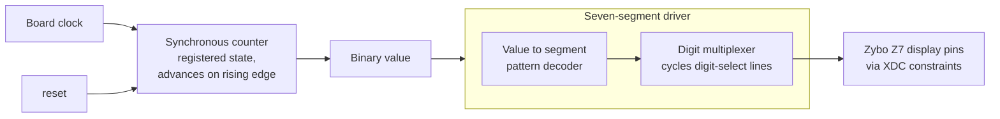

# VHDL Counter and Seven-Segment Display Driver

Synthesizable VHDL for a clocked counter and a multiplexed seven-segment display driver, constrained and verified on a Zybo Z7 FPGA.

## Overview

University of Delaware coursework: **CPEG 202, Introduction to Digital Systems (Spring 2023)**. A sequential-logic lab pairing a synchronous counter with the display hardware needed to actually see its output on the board.

The two modules are the standard building blocks of anything that has to show a number on an FPGA: a counter that advances state on a clock edge, and a display driver that turns a binary value into segment patterns and cycles the digit-select lines fast enough to look continuous.

> **Related:** a fuller set of my VHDL work from this course — multiplexers, barrel shifter, stopwatch, adder/subtractor, D flip-flop with testbench, and a Pong game — is collected in **[fpga-digital-design-labs](https://github.com/DestinyU7/fpga-digital-design-labs)**.

## Hardware

- **Digilent Zybo Z7** (Xilinx Zynq-7000)
- On-board seven-segment display, slide switches, push buttons

## Software / Tools

- **VHDL** (IEEE 1164)
- **Xilinx Vivado** — synthesis, implementation, behavioural simulation, bitstream generation
- **XDC constraints** for pin assignment

## Architecture



## Key Engineering Work

**Synchronous sequential design.** The counter updates only on the clock edge with a defined reset behaviour, which is what makes it synthesizable into flip-flops rather than into latches or a timing hazard.

**Display multiplexing.** Multiple digits share segment lines, so only one can be lit at any instant. The driver cycles the digit-select lines rapidly while presenting the matching segment pattern, exploiting persistence of vision to show a stable multi-digit number — a large pin saving bought with a timing constraint.

**Segment decoding.** Binary values are mapped to the seven-segment patterns that render them as readable digits, implemented as combinational logic.

**Constraint-driven I/O.** `constraints/Zybo-Z7-Master-3.xdc` binds every signal to a physical pin. A design that simulates perfectly does nothing on hardware without it.

## Testing / Validation

- **Behavioural simulation in Vivado** before synthesis, checking counter sequencing and reset behaviour against expected values.
- **On-board hardware verification** — counter output read directly off the seven-segment display, with multiplex refresh rate confirmed visually to be fast enough to avoid flicker.
- **Reset and rollover behaviour** exercised on hardware, which is where the difference between simulated and real timing shows up.

## Repository Structure

```
src/
  MumfordTimothy_counter.vhd   synchronous counter
  MumfordTimothy_ssd-1.vhd     seven-segment display driver
constraints/
  Zybo-Z7-Master-3.xdc         Zybo Z7 pin constraints
```

## What I Learned

The display driver taught the more interesting lesson. Multiplexing is a trade — you give up guaranteed-simultaneous output and buy back a large number of I/O pins, paid for with a timing requirement. Get the refresh rate wrong and the failure is visible flicker rather than a compiler error, which is a very different debugging experience from software.

## Academic Context

University of Delaware, CPEG 202 — Introduction to Digital Systems, Spring 2023. Lab specification provided by the course; the VHDL and constraints are my own.
